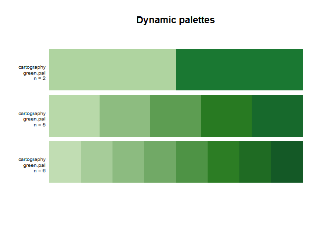

<!-- README.md is generated from README.Rmd. Please edit that file -->

# paletteer 

<!-- badges: start -->

[](https://github.com/EmilHvitfeldt/paletteer/actions)
[](https://cran.r-project.org/package=paletteer)
[](https://CRAN.R-project.org/package=paletteer)
[](https://codecov.io/github/EmilHvitfeldt/paletteer?branch=main)
[](https://lifecycle.r-lib.org/articles/stages.html)
<!-- badges: end -->

The goal of **paletteer** is to be a comprehensive collection of color
palettes in R using a common interface. Think of it as the “caret of
palettes”.

**Notice** This version is not backwards compatible with versions \<=
0.2.1. Please refer to the end of the readme for breaking changes

## Installation

You can install the released version of **paletteer** from
[CRAN](https://CRAN.R-project.org) with:

``` r
install.packages("paletteer")
```

If you want the development version instead then install directly from
GitHub:

``` r
# install.packages("devtools")
devtools::install_github("EmilHvitfeldt/paletteer")
```

## Palettes

The palettes are divided into 2 groups; *discrete* and *continuous*. For
discrete palette you have the choice between the *fixed width palettes*
and *dynamic palettes*. Most common of the two are the fixed width
palettes which have a set amount of colors which doesn’t change when the
number of colors requested vary like the following palettes:

<!-- -->

on the other hand we have the dynamic palettes where the colors of the
palette depend on the number of colors you need like the `green.pal`
palette from the `cartography` package:

<!-- -->

Lastly we have the continuous palettes which provides as many colors as
you need for a smooth transition of color:

<!-- -->

This package includes 2392 palettes from 62 different packages and
information about these can be found in the following data.frames:
`palettes_c_names`, `palettes_d_names` and `palettes_dynamic_names`.
Additionally this [github
repo](https://github.com/EmilHvitfeldt/r-color-palettes) showcases all
the palettes included in the package and more.

## Examples

All the palettes can be accessed from the 3 functions `paletteer_c()`,
`paletteer_d()` and `paletteer_dynamic()` using the by using the syntax
packagename::palettename.

``` r
paletteer_c("scico::berlin", n = 10)
#> <colors>
#> #9EB0FFFF #5AA3DAFF #2D7597FF #194155FF #11181DFF #270C01FF #501802FF #8A3F2AFF #C37469FF #FFACACFF
paletteer_d("nord::frost")
#> <colors>
#> #8FBCBBFF #88C0D0FF #81A1C1FF #5E81ACFF
paletteer_dynamic("cartography::green.pal", 5)
#> <colors>
#> #B8D9A9FF #8DBC80FF #5D9D52FF #287A22FF #17692CFF
```

All of the functions now also support tab completion to easily access
the hundreds of choices


## ggplot2 scales

Lastly the package also includes scales for `ggplot2` using the same
standard interface

``` r
library(ggplot2)

ggplot(iris, aes(Sepal.Length, Sepal.Width, color = Species)) +
  geom_point() +
  scale_color_paletteer_d("nord::aurora")
```

<!-- -->

## Breaking changes

In version \<= 0.2.1 a palatte was selected by specifying a `package`
and `palette` argument like so

``` r
paletteer_c(package = "nord", palette = "frost")
```

After version 0.2.1 palettes are selected using the syntax
`"packagename::palettename"` inside the palette functions.

``` r
paletteer_c("nord::frost")
```

## Special thanks

- [Hadley Wickham](https://github.com/hadley) For helpful code
  improvements.

## Included packages

**paletteer** includes palettes from the following packages:

| Name               | Github                                                                                          | CRAN                                                       |
|:-------------------|:------------------------------------------------------------------------------------------------|:-----------------------------------------------------------|
| awtools            | [awhstin/awtools - 0.2.1](https://github.com/awhstin/awtools)                                   | \-                                                         |
| basetheme          | [karoliskoncevicius/basetheme - 0.1.2](https://github.com/karoliskoncevicius/basetheme)         | [0.1.2](https://CRAN.R-project.org/package=basetheme)      |
| beyonce            | [dill/beyonce - 0.1](https://github.com/dill/beyonce)                                           | \-                                                         |
| calecopal          | [an-bui/calecopal - 0.1.0](https://github.com/an-bui/calecopal)                                 | \-                                                         |
| cartography        | [riatelab/cartography - 3.0.1](https://github.com/riatelab/cartography)                         | [3.0.1](https://CRAN.R-project.org/package=cartography)    |
| colorBlindness     | \-                                                                                              | [0.1.9](https://CRAN.R-project.org/package=colorBlindness) |
| colorblindr        | [clauswilke/colorblindr - 0.1.0](https://github.com/clauswilke/colorblindr)                     | \-                                                         |
| colRoz             | [jacintak/colRoz - 0.2.2](https://github.com/jacintak/colRoz)                                   | \-                                                         |
| dichromat          | \-                                                                                              | [2.0-0.1](https://CRAN.R-project.org/package=dichromat)    |
| DresdenColor       | [katiesaund/DresdenColor - 0.0.0.9000](https://github.com/katiesaund/DresdenColor)              | \-                                                         |
| dutchmasters       | [EdwinTh/dutchmasters - 0.1.0](https://github.com/EdwinTh/dutchmasters)                         | \-                                                         |
| fishualize         | [nschiett/fishualize - 0.2.3](https://github.com/nschiett/fishualize)                           | [0.2.3](https://CRAN.R-project.org/package=fishualize)     |
| futurevisions      | [JoeyStanley/futurevisions - 0.1.1](https://github.com/JoeyStanley/futurevisions)               | \-                                                         |
| gameofthrones      | [aljrico/gameofthrones - 1.0.2](https://github.com/aljrico/gameofthrones)                       | [1.0.2](https://CRAN.R-project.org/package=gameofthrones)  |
| ggpomological      | [gadenbuie/ggpomological - 0.1.2](https://github.com/gadenbuie/ggpomological)                   | \-                                                         |
| ggprism            | [csdaw/ggprism - 1.0.3.9000](https://github.com/csdaw/ggprism)                                  | [1.0.3](https://CRAN.R-project.org/package=ggprism)        |
| ggsci              | [nanxstats/ggsci - 2.9](https://github.com/nanxstats/ggsci)                                     | [2.9](https://CRAN.R-project.org/package=ggsci)            |
| ggthemes           | [jrnold/ggthemes - 4.2.2](https://github.com/jrnold/ggthemes)                                   | [4.2.2](https://CRAN.R-project.org/package=ggthemes)       |
| ggthemr            | [Mikata-Project/ggthemr - 1.1.0](https://github.com/Mikata-Project/ggthemr)                     | \-                                                         |
| ghibli             | [ewenme/ghibli - 0.3.3.9000](https://github.com/ewenme/ghibli)                                  | [0.3.3](https://CRAN.R-project.org/package=ghibli)         |
| grDevices          | \-                                                                                              | 4.2.1                                                      |
| harrypotter        | [aljrico/harrypotter - 2.1.1](https://github.com/aljrico/harrypotter)                           | [2.1.1](https://CRAN.R-project.org/package=harrypotter)    |
| IslamicArt         | [lambdamoses/IslamicArt - 0.1.0](https://github.com/lambdamoses/IslamicArt)                     | \-                                                         |
| jcolors            | [jaredhuling/jcolors - 0.0.4](https://github.com/jaredhuling/jcolors)                           | [0.0.4](https://CRAN.R-project.org/package=jcolors)        |
| khroma             | [tesselle/khroma - 1.9.0.9000](https://github.com/tesselle/khroma)                              | [1.9.0](https://CRAN.R-project.org/package=khroma)         |
| LaCroixColoR       | [johannesbjork/LaCroixColoR - 0.1.0](https://github.com/johannesbjork/LaCroixColoR)             | \-                                                         |
| lisa               | [tyluRp/lisa - 0.1.2.9000](https://github.com/tyluRp/lisa)                                      | [0.1.2](https://CRAN.R-project.org/package=lisa)           |
| Manu               | [G-Thomson/Manu - 0.0.2](https://github.com/G-Thomson/Manu)                                     | \-                                                         |
| MapPalettes        | [disarm-platform/MapPalettes - 0.0.2](https://github.com/disarm-platform/MapPalettes)           | \-                                                         |
| miscpalettes       | [EmilHvitfeldt/miscpalettes - 0.0.0.9000](https://github.com/EmilHvitfeldt/miscpalettes)        | \-                                                         |
| nationalparkcolors | [katiejolly/nationalparkcolors - 0.1.0](https://github.com/katiejolly/nationalparkcolors)       | \-                                                         |
| nbapalettes        | [murrayjw/nbapalettes - 0.1.0.9000](https://github.com/murrayjw/nbapalettes)                    | [0.1.0](https://CRAN.R-project.org/package=nbapalettes)    |
| NineteenEightyR    | [m-clark/NineteenEightyR - 0.1.0](https://github.com/m-clark/NineteenEightyR)                   | \-                                                         |
| nord               | [jkaupp/nord - 1.0.0](https://github.com/jkaupp/nord)                                           | [1.0.0](https://CRAN.R-project.org/package=nord)           |
| ochRe              | [hollylkirk/ochRe - 1.0.0](https://github.com/hollylkirk/ochRe)                                 | \-                                                         |
| oompaBase          | \-                                                                                              | [3.2.9](https://CRAN.R-project.org/package=oompaBase)      |
| palettesForR       | [frareb/palettesForR - 0.1.2](https://github.com/frareb/palettesForR)                           | [0.1.2](https://CRAN.R-project.org/package=palettesForR)   |
| palettetown        | [timcdlucas/palettetown - 0.1.1.90000](https://github.com/timcdlucas/palettetown)               | [0.1.1](https://CRAN.R-project.org/package=palettetown)    |
| palr               | [AustralianAntarcticDivision/palr - 0.3.0](https://github.com/AustralianAntarcticDivision/palr) | [0.3.0](https://CRAN.R-project.org/package=palr)           |
| pals               | [kwstat/pals - 1.7](https://github.com/kwstat/pals)                                             | [1.7](https://CRAN.R-project.org/package=pals)             |
| PNWColors          | [jakelawlor/PNWColors - 0.1.0](https://github.com/jakelawlor/PNWColors)                         | \-                                                         |
| Polychrome         | \-                                                                                              | [1.5.1](https://CRAN.R-project.org/package=Polychrome)     |
| popthemes          | [johnmackintosh/popthemes - 0.0.0.9000](https://github.com/johnmackintosh/popthemes)            | \-                                                         |
| rcartocolor        | [Nowosad/rcartocolor - 2.1.0](https://github.com/Nowosad/rcartocolor)                           | [2.1.0](https://CRAN.R-project.org/package=rcartocolor)    |
| RColorBrewer       | \-                                                                                              | [1.1-3](https://CRAN.R-project.org/package=RColorBrewer)   |
| Redmonder          | \-                                                                                              | [0.2.0](https://CRAN.R-project.org/package=Redmonder)      |
| rockthemes         | [johnmackintosh/rockthemes - 0.0.0.9000](https://github.com/johnmackintosh/rockthemes)          | \-                                                         |
| RSkittleBrewer     | [alyssafrazee/RSkittleBrewer - 1.1](https://github.com/alyssafrazee/RSkittleBrewer)             | \-                                                         |
| rtist              | [tomasokal/rtist - 1.0.0](https://github.com/tomasokal/rtist)                                   | [1.0.0](https://CRAN.R-project.org/package=rtist)          |
| scico              | [thomasp85/scico - 1.3.1.9000](https://github.com/thomasp85/scico)                              | [1.3.1](https://CRAN.R-project.org/package=scico)          |
| soilpalettes       | [kaizadp/soilpalettes - 0.1.0](https://github.com/kaizadp/soilpalettes)                         | \-                                                         |
| suffrager          | [alburezg/suffrager - 0.1.0](https://github.com/alburezg/suffrager)                             | \-                                                         |
| tayloRswift        | [asteves/tayloRswift - 0.1.0](https://github.com/asteves/tayloRswift)                           | \-                                                         |
| tidyquant          | [business-science/tidyquant - 1.0.5.9000](https://github.com/business-science/tidyquant)        | [1.0.5](https://CRAN.R-project.org/package=tidyquant)      |
| trekcolors         | [leonawicz/trekcolors - 0.1.3](https://github.com/leonawicz/trekcolors)                         | [0.1.3](https://CRAN.R-project.org/package=trekcolors)     |
| tvthemes           | [Ryo-N7/tvthemes - 1.3.1](https://github.com/Ryo-N7/tvthemes)                                   | [1.3.1](https://CRAN.R-project.org/package=tvthemes)       |
| unikn              | [hneth/unikn - 0.6.0.9006](https://github.com/hneth/unikn)                                      | [0.6.0](https://CRAN.R-project.org/package=unikn)          |
| vapeplot           | [seasmith/vapeplot - 0.1.0](https://github.com/seasmith/vapeplot)                               | \-                                                         |
| vapoRwave          | [moldach/vapoRwave - 0.0.0.9000](https://github.com/moldach/vapoRwave)                          | \-                                                         |
| viridis            | [sjmgarnier/viridis - 0.6.2](https://github.com/sjmgarnier/viridis)                             | [0.6.2](https://CRAN.R-project.org/package=viridis)        |
| visibly            | [m-clark/visibly - 0.2.9](https://github.com/m-clark/visibly)                                   | \-                                                         |
| werpals            | [sciencificity/werpals - 0.1.0](https://github.com/sciencificity/werpals)                       | \-                                                         |
| wesanderson        | [karthik/wesanderson - 0.3.6.9000](https://github.com/karthik/wesanderson)                      | [0.3.6](https://CRAN.R-project.org/package=wesanderson)    |
| yarrr              | [ndphillips/yarrr - 0.1.6](https://github.com/ndphillips/yarrr)                                 | [NA](https://CRAN.R-project.org/package=yarrr)             |
